# Training Plots for Each Layer

<!-- ## Layer 8
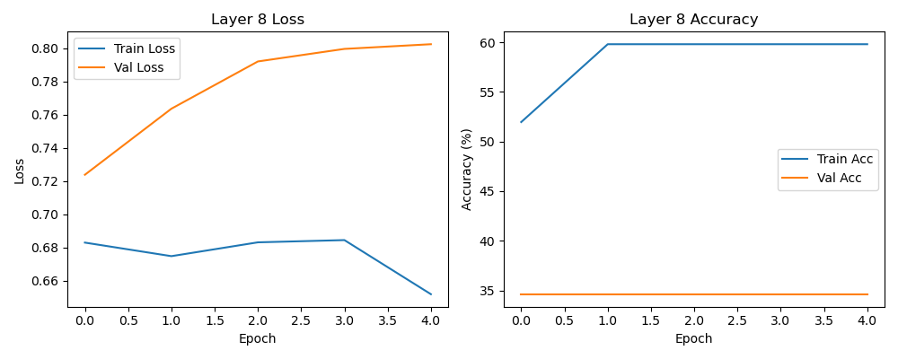

## Layer 16
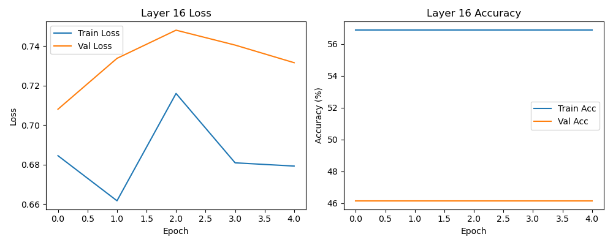

## Layer 24
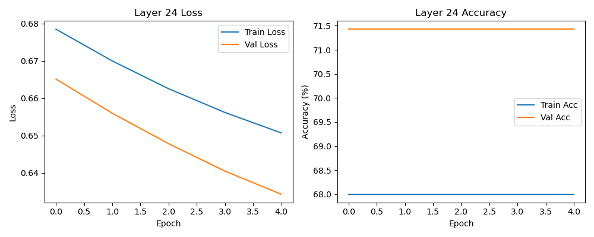 -->

<!-- ## Layer 20
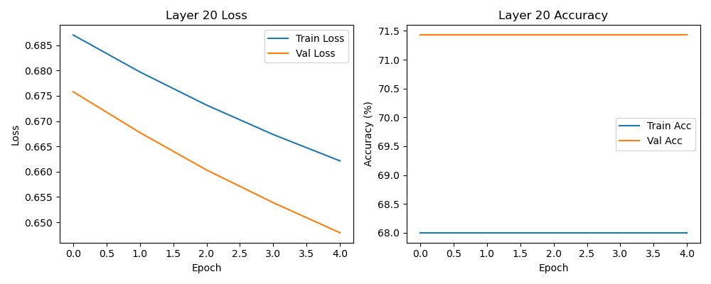

## Layer 21
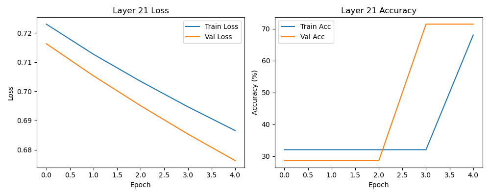

## Layer 22
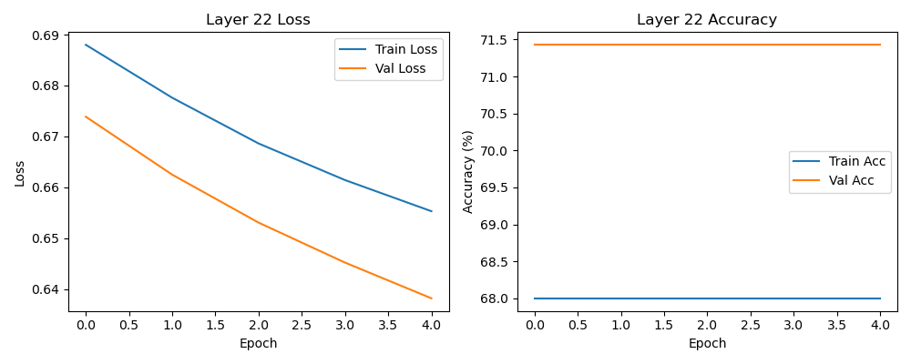

## Layer 23

## Layer 24

## Layer 25
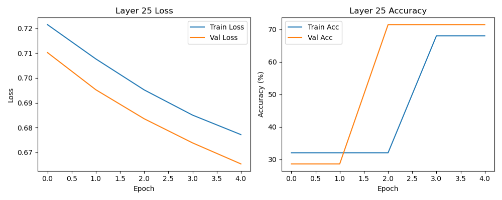 -->

## Layer 26
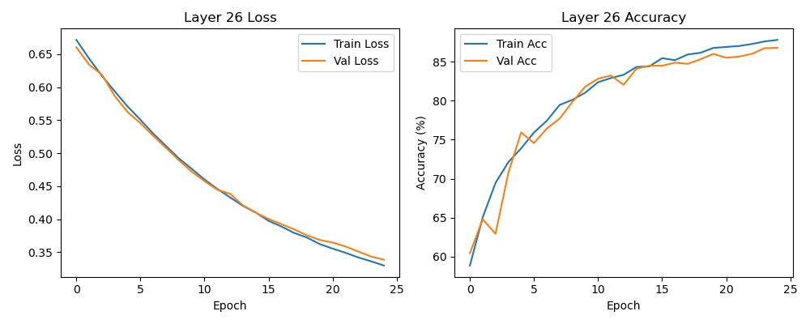

<!-- ## Layer 27
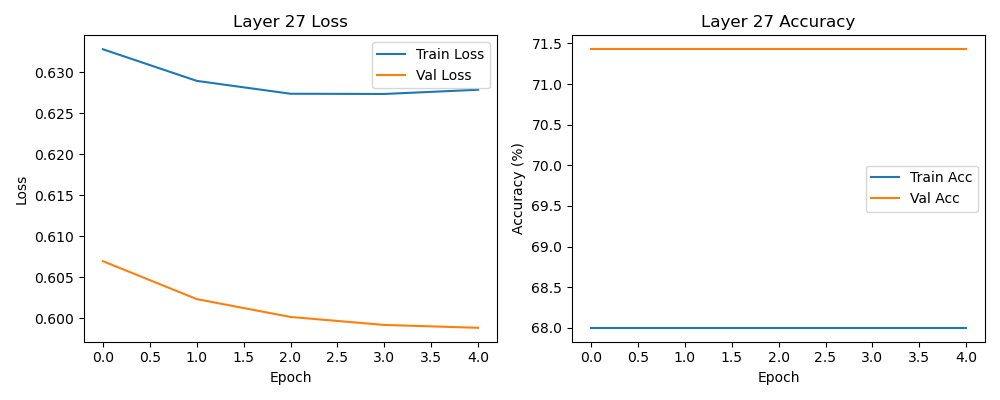

## Layer 28
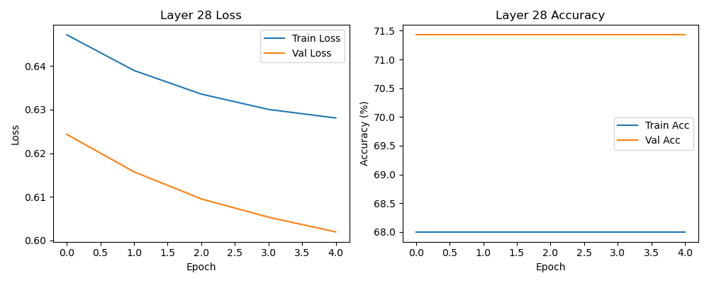

## Layer 29
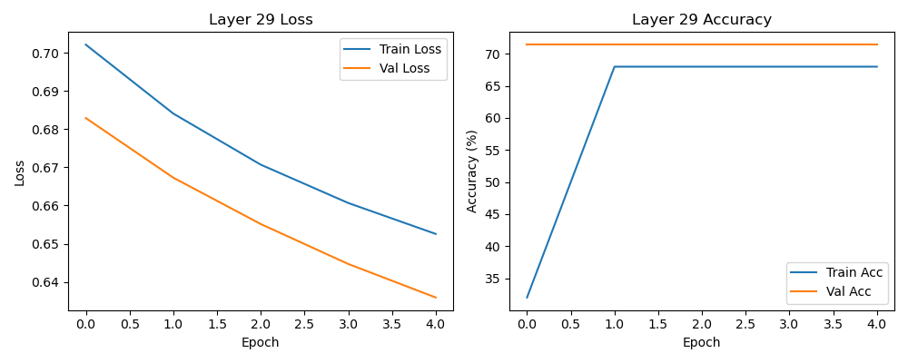 -->

## Layer 30
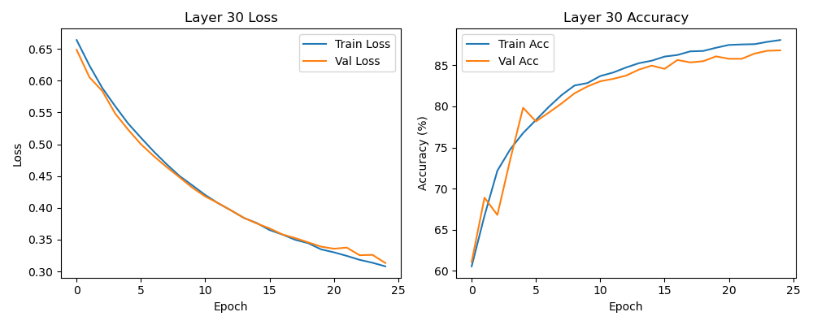

## Layer 31
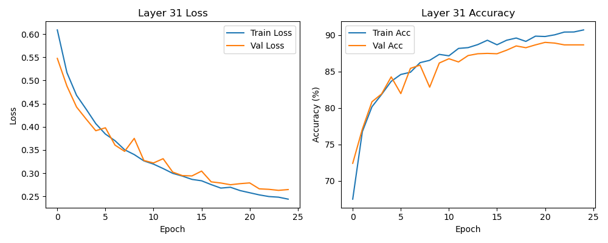