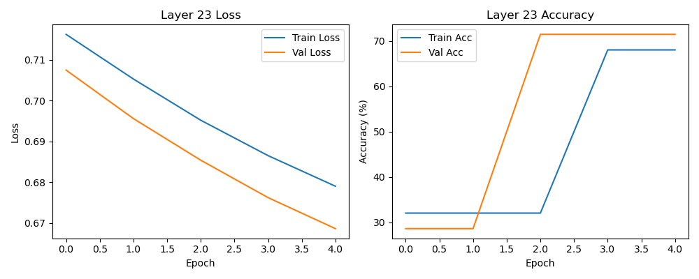

# Training Plots for Each Layer

<!-- ## Layer 8

## Layer 16

## Layer 24
 -->

<!-- ## Layer 20

## Layer 21

## Layer 22

## Layer 23

## Layer 24

## Layer 25
 -->

## Layer 26

<!-- ## Layer 27

## Layer 28

## Layer 29
 -->

## Layer 30

## Layer 31
